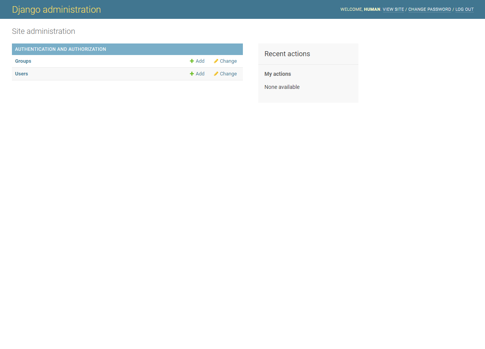

# 프로젝트 개요
- Python Django로 To-do List를 만들어본다. 

# 파이썬 설치
- 파이썬 설치는 Anaconda 또는 Python 홈페이지에서 직접 설치한다.
    + Anaconda : https://www.anaconda.com/
    + Python : https://www.python.org/

# 가상환경 설치
- 파이썬 설치가 끝났다면, 해당 깃허브를 다운로드 받는다.  
```bash 
$ git clone https://github.com/dschloe/django_to_do.git
```

- django_to_do 폴더에 진입 후 아래와 같이 실행한다. 
```bash
$ cd django_to_do
$ virtualenv venv
created virtual environment CPython3.9.7.final.0-64 in 7884ms     
  creator CPython3Windows(dest=C:\Users\human\Desktop\django_to_do\venv, clear=False, no_vcs_ignore=False, global=False)
  seeder FromAppData(download=False, pip=bundle, setuptools=bundle, wheel=bundle, via=copy, app_data_dir=C:\Users\human\AppData\Local\pypa\virtualenv)
    added seed packages: pip==22.0.4, setuptools==62.1.0, wheel==0.37.1
  activators BashActivator,BatchActivator,FishActivator,NushellActivator,PowerShellActivator,PythonActivator
```

- 실제 실행 후 venv 폴더가 나타나는지 확인한다. 
```bash
$ ls
README.md  venv/
```

- 가상환경에 접속한다. 
```bash
$ source venv/Scripts/activate
(venv)
```

# 환경 설정 Django

## Installing Django
- Django : https://www.djangoproject.com/
- 가상환경이 접속된 상태에서 `django`와 시간 계산을 위해 `pytz`를 설치한다. 
```bash
$ pip install django pytz
```

## my_app 폴더 생성
- 새로운 폴더 `my_app` 하나 생성 후 해당 경로에 접속한다.
```bash
$ mkdir my_app && cd my_app
```

## djanog 개발 시작
- 이제 `django` 프로젝트를 시작한다. 
- `django` 설치 후, `todo_app` 폴더와 `manage.py`가 실행되는지 확인한다. 
```bash
$ django-admin startproject todo_app .
$ ls
manage.py*  todo_app/
```

## 초기 화면 실행
- `my_app` 폴더에서 서버를 구동시킨다. 
    + 접속 URL : http://127.0.0.1:8000/
```bash
$ python manage.py runserver
```


- 이번에는 해당 서버에서 http://127.0.0.1:8000/admin을 실행시킨다. 


- DB 스키마 생성 위해 이번에는 `python manage.py migrate`를 실행한다. 

```bash
$ python manage.py migrate
```

## 관리자 유저 생성
- 관리자 유저를 생성하도록 한다. 
    + username : human
    + password : 
```bash
$ python manage.py createsuperuser
Username (leave blank to use 'yourname'): 
Email address: your_email@email.com
Password: 
Password (again):
```

- 이제 다시 admin 페이지에 접속하고, `username`과 `password`를 입력한다. 
    + 정상적으로 입력하면 아래와 같이 로그인이 되면 성공이다. 


# todo_list 웹 폴더 생성
- `todo_app`은 메인 앱이라 생각하면 되고, 하단에 todo_list 서브앱을 생성한다. 
```bash
$ python manage.py startapp todo_list
$ ls
db.sqlite3  manage.py*  todo_app/  todo_list/
```

- 이번에는 todo_app에 `todo_list` 웹을 등록하는 코드를 작성한다. 
  + `todo_list`를 추가한다.
  + 파일경로 : todo_app/settings.py
```python
.
.
INSTALLED_APPS = [
    'django.contrib.admin',
    'django.contrib.auth',
    'django.contrib.contenttypes',
    'django.contrib.sessions',
    'django.contrib.messages',
    'django.contrib.staticfiles',
    'todo_list',
]
.
.
```

## urls.py 수정
- 먼저, `todo_app` 폴더 하단에 `urls.py` 코드에 아래 코드를 추가한다. 
- 아래 코드는 웹사이트의 경로를 지정해주는 코드다.
```python
from django.contrib import admin
from django.urls import path, include
from todo_list import views

urlpatterns = [
    path('admin/', admin.site.urls),
    path('', include('todo_list.urls')),
]
```

## 기본 페이지 만들기
- 주의) 파일 경로를 잘 확인한다. 
- 우선, `runserver` 실행 시, `Hello World`가 나타나도록 만들어본다.
- 먼저, `views.py`에 다음과 같은 코드를 생성한다. 
  + 파일경로 : `todo_list/views.py`
  + `home.html` 파일은 바로 생성할 것이다. 

```python
from wsgiref.util import request_uri
from django.shortcuts import render

# Create your views here.
def home(request):
    return render(request, 'home.html', {})
```
- `templates` 폴더를 생성한 뒤, `home.html`과 `about.html` 파일을 생성하고, 간단하게 아래코드를 추가한다. 
- `home.html`
  + 파일경로 : `todo_list/templates/home.html`
```html
<h1>Hello World! HomePage!!</h1>
```

- `about.html`
  + 파일경로 : `todo_list/templates/about.html`

```
<h1>about Page</h1>
```

- 이번에는 todo_list 폴더 하단에 urls.py를 생성한다. 
  + 다음 코드를 추가한다. 

```python
from django.urls import path
from . import views

urlpatterns = [
    path('', views.home, name='home'), 
    path('about/', views.about, name='about'),
]
```

- 파일이 완성되었다면 runserver를 실행한다. 그림에서 보는 것처럼 about 페이지가 만들어진 것을 확인할 수 있다. 
```bash
$ python manage.py runserver
```

